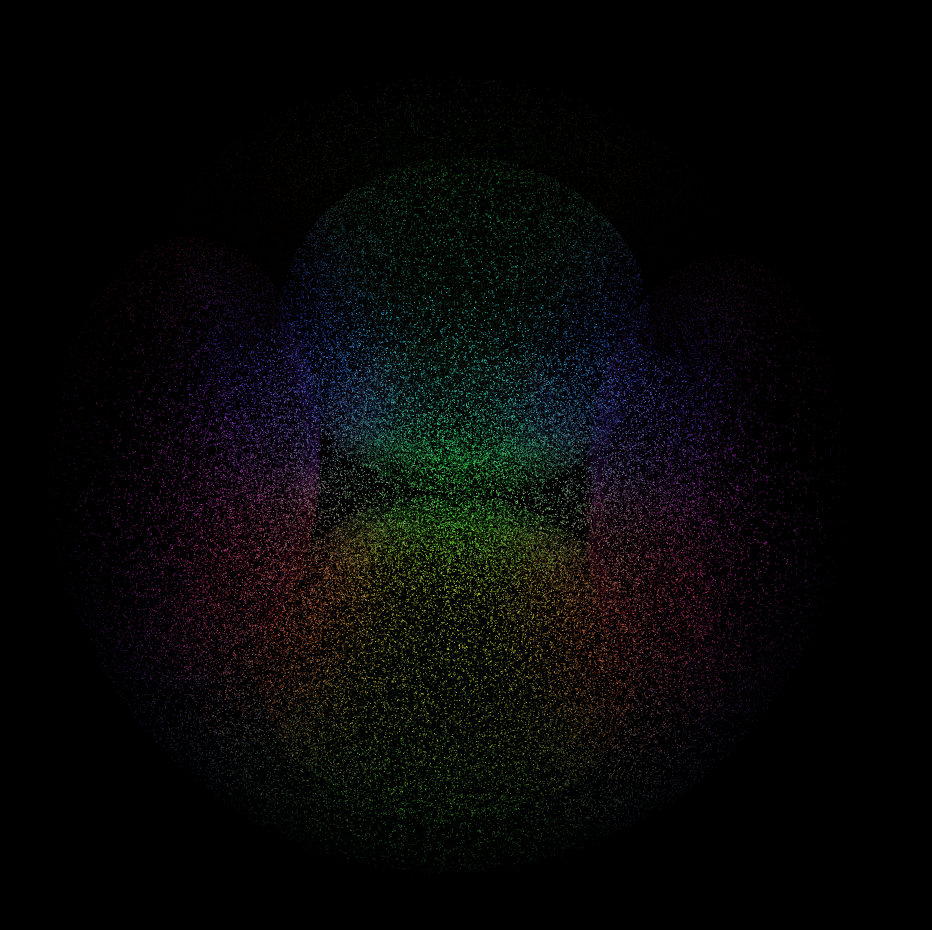

# hyper

* [01](https://ailove-lab.github.io/hyper/01.html)
* [02](https://ailove-lab.github.io/hyper/02.html)
* [03](https://ailove-lab.github.io/hyper/03.html)
* [04](https://ailove-lab.github.io/hyper/04.html)
* [05](https://ailove-lab.github.io/hyper/05.html)
* [06](https://ailove-lab.github.io/hyper/06.html)
* [07](https://ailove-lab.github.io/hyper/07.html)
* [08](https://ailove-lab.github.io/hyper/08.html)
* [09](https://ailove-lab.github.io/hyper/09.html)
